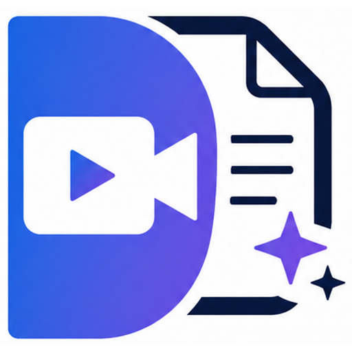

<p align="center">
  
</p>

<h1 align="center">Doculigent</h1>

<p align="center">
  <b>Open-source, local-first screen recorder + AI video workspace.</b><br />
  Record your screen, annotate it live, transcribe it, and ask an AI about it — all without your video ever leaving your machine unless you want it to.
</p>

<p align="center">
  <a href="https://doculigent.com"><b>Website</b></a> ·
  <a href="https://github.com/baraklabs/doculigent/releases"><b>Download</b></a> ·
  <a href="#features">Features</a> ·
  <a href="#getting-started">Getting Started</a> ·
  <a href="#building-from-source">Build from Source</a>
</p>

<p align="center">
  
  
</p>

---

## Why Doculigent?

Doculigent records your screen, lets you draw and annotate live while recording, transcribes the audio, and lets you chat with AI about what happened in the recording — all processed and stored locally on your machine by default:

- **Local-first** — recordings, transcripts, and your video library live on your machine. Nothing is uploaded unless you explicitly sign in and share it.
- **AI built in** — summarize a recording or chat with an assistant about what happened in it, powered by whichever LLM provider you configure.
- **Draw on your screen live** — annotate directly over anything on your display while recording, like a built-in Epic Pen.
- **Meetings included** — capture microphone + system audio together and get a transcript out the other end.
- **Free and open source** — AGPL-3.0 licensed. Read the code, audit it, self-host it, fork it.

## Features

- 🎥 **Screen & window recording** — pick any display or window and record it, with a live cursor-highlight overlay
- 🖊️ **Draw on screen** — a system-wide annotation layer (pen, shapes, arrows, color picker, undo/redo) that overlays your entire desktop while you record
- 🎙️ **Meeting recording** — mic + system audio capture with live transcription
- 📝 **Transcription** — on-device transcription powered by Whisper, with selectable model sizes
- 🤖 **AI summaries & chat** — summarize a transcript or ask follow-up questions, using your own LLM provider profile (bring your own API key)
- 📚 **Library** — search, rename, trim, and manage all your recordings in one place
- ☁️ **Optional cloud sync** — sign in with a free [doculigent.com](https://doculigent.com) account to sync and share recordings across devices; everything still works fully offline without one
- 🖥️ **Platform** — native desktop app for Windows, macOS(coming soon), and Linux(coming soon)

## Getting Started

The easiest way to use Doculigent is to grab a prebuilt release for your platform:

👉 **[Download the latest release](https://github.com/baraklabs/doculigent/releases)**

Or visit **[doculigent.com](https://doculigent.com)** to learn more about the project and the (optional) cloud account.

## Building from Source

Doculigent is an [Electron](https://www.electronjs.org/) app built with [electron-vite](https://electron-vite.org/), React, and TypeScript.

### Prerequisites

- [Node.js](https://nodejs.org/) 18 or later
- npm (comes with Node.js)

### Setup

```bash
# 1. Clone the repository
git clone https://github.com/baraklabs/doculigent.git
cd doculigent

# 2. Install dependencies
npm install
```

### Run in development

```bash
npm run dev
```

This starts the app in dev mode with hot reload for the renderer.

### Type-check

```bash
npm run typecheck
```

### Build a production package

```bash
npm run build
```

This builds the app and packages it for your current platform (Windows `.exe`/NSIS, macOS `.dmg`, or Linux `.deb`/AppImage) into the `dist/` folder using `electron-builder`.

To build an unpacked directory instead of an installer (useful for quick local testing):

```bash
npm run build:unpack
```

## Contributing

Issues and pull requests are welcome! If you find a bug or have a feature idea, please [open an issue](https://github.com/baraklabs/doculigent/issues).

## License

Doculigent is licensed under the [AGPL-3.0](LICENSE).

---

<p align="center">
  Made with ❤️
</p>
