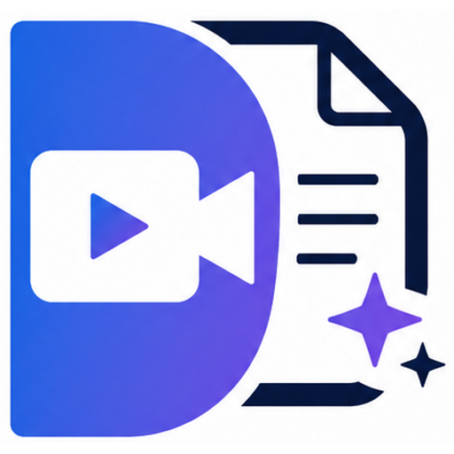
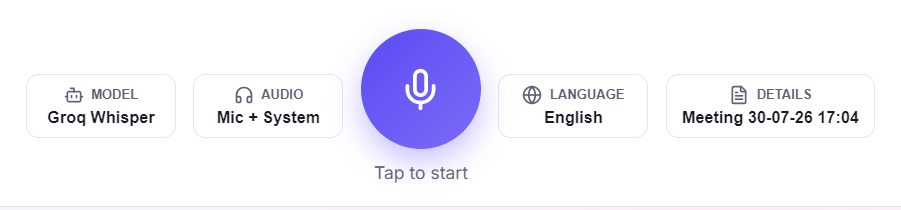
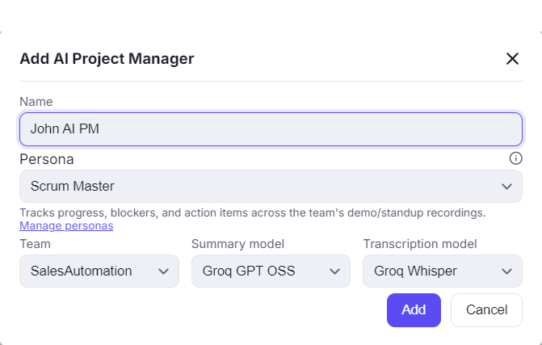
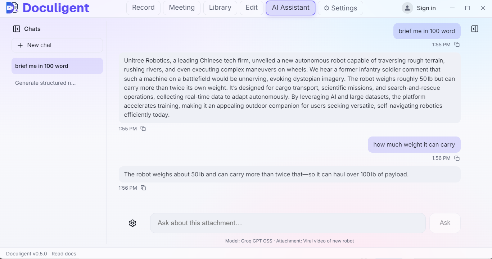
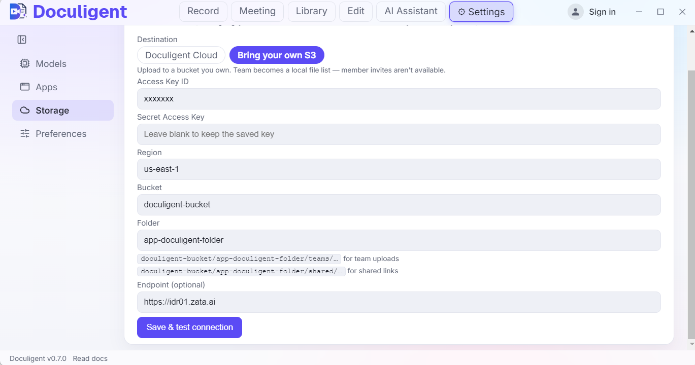

<p align="center">
  
</p>

<h1 align="center">Doculigent</h1>

<p align="center">
  <b>Open-source, local-first AI workspace for meetings and async work.</b><br />
  Record your screen, meetings, and demos, annotate them live, transcribe recordings, chat with AI, generate documentation and team insights, automate workflows with AI Project Managers, and optionally use your own S3-compatible storage—all while keeping your data under your control.
</p>

<p align="center">
  <a href="https://doculigent.com"><b>Website</b></a> ·
  <a href="https://github.com/baraklabs/doculigent/releases"><b>Download</b></a> ·
  <a href="#features">Features</a> ·
  <a href="#in-action">In Action</a> ·
  <a href="#getting-started">Getting Started</a> ·
  <a href="#building-from-source">Build from Source</a>
</p>

<p align="center">
  
  
</p>

<p align="center">
  <a href="https://www.doculigent.com/"></a>
  <a href="https://www.youtube.com/@doculigent"></a>
  <a href="https://x.com/doculigent"></a>
  <a href="https://www.linkedin.com/company/doculigent"></a>
</p>

---

## Why Doculigent?

Doculigent is an **open-source, local-first AI workspace** for meetings, demos, and async work. Record your screen or meetings, annotate live, transcribe conversations, chat with AI, generate documentation, and automate team workflows—all while keeping your data under your control.

* **Local-first** — recordings, transcripts, AI insights, and your library stay on your machine by default. Nothing is uploaded unless you choose to share or connect cloud storage.
* **AI built in** — summarize recordings, ask questions, generate documentation, extract action items, and analyze recordings using configurable LLM providers or local AI.
* **AI Project Managers** — automatically analyze recordings from the perspective of a Scrum Master, Product Manager, Sales, Customer Success, or your own custom persona to generate team insights and actionable reports.
* **Custom AI Personas** — create AI assistants with your own instructions, prompts, and focus areas to tailor summaries and analysis to your workflow.
* **Draw on your screen live** — annotate directly over any application while recording with pens, shapes, arrows, and highlights.
* **Bring Your Own S3-Compatible Storage** — connect Amazon S3, Cloudflare R2, MinIO, or any S3-compatible storage to keep complete ownership of your recordings while still benefiting from AI.
* **Teams & collaboration** — organize recordings into teams, collaborate with colleagues, and generate insights across your team's knowledge.
* **Free and open source** — AGPL-3.0 licensed. Audit the code, self-host it, contribute, or build on top of it.

## Features

* 🎥 **Screen, window & meeting recording** — capture any display, window, microphone, and system audio.
* 🖊️ **Live screen annotation** — draw, highlight, add arrows and shapes while recording, just like a built-in Epic Pen.
* 🎙️ **AI transcription** — fast on-device transcription powered by Whisper with selectable model sizes or your preferred LLM provider.
* 🤖 **AI Assistant** — chat with recordings, generate summaries, documentation, meeting notes, and action items using your preferred LLM provider or local AI.
* 👥 **Teams** — organize recordings into shared workspaces, collaborate with teammates, and keep everyone aligned.
* 🧠 **AI Project Managers** — analyze every recording, generate per-recording insights, identify completed work, blockers, risks, and next steps, then create an overall team summary. Run on demand or on a schedule.
* 🎭 **Custom Personas** — create AI assistants and Project Managers tailored to your organization's workflows.
* ☁️ **Bring Your Own S3-Compatible Storage** — use Amazon S3, Cloudflare R2, MinIO, Backblaze B2, DigitalOcean Spaces, or any S3-compatible storage instead of Doculigent Cloud.
* 📚 **Recording library** — search, organize, and manage recordings, transcripts, and AI-generated knowledge in one place.
* 🔄 **Optional cloud sync & sharing** — use Doculigent Cloud or your own S3 storage to sync recordings and securely share them with your team.
* 🖥️ **Cross-platform desktop app** — available for Windows, with macOS and Linux support coming soon.


## In Action

### 🎙️ Meeting recording, transcribed live

Start a meeting and Doculigent captures your **microphone and system audio together**, so both sides of the conversation are on tape — no separate call-recording setup needed. Pick your transcription engine (on-device Whisper or a connected model like Groq Whisper), pick the language, and hit record. The moment the meeting ends you have a full, ready to search, or hand straight to the AI Assistant.

<p align="center">
  
</p>

### 🤖 AI Project Managers — a persona-driven agent per team

An **AI Project Manager** is an agent you point at a team and give a role. Pick a built-in persona — **Scrum Master**, **Sales**, **Product Manager**, **Customer Success** — or write your own custom persona with its own instructions and focus, and it will:

- Generate a quick + detailed insight for each recording, framed around that persona's focus (blockers/action items for a Scrum Master, deal signals for Sales, and so on).
- AI Project Managers analyze every recording and provide a quick overview of completed work, ongoing tasks, blockers, and next steps. 
- Roll every file's insight up into one overall summary across the whole team
- Run on demand with a click, or on a daily schedule, fully unattended

<p align="center">
  
</p>

### 💬 Chat with any recording

Attach a recording — or a live meeting — to the AI Assistant and ask it questions the way you'd ask a colleague who was in the room: *"brief me in 100 words"*, *"how much weight can it carry"*, *"what did we agree to ship first"*. One-click **Summarize** and **Generate Notes** shortcuts cover the common cases, full conversation history is saved per chat, and everything is grounded in the actual transcript — not a guess.

<p align="center">
  
</p>

### 🔒 Runs entirely on your infrastructure — bring your own S3

None of the above requires trusting anyone else's servers with your data:

- Recordings, transcripts, and chat history live **locally on disk by default** — no account required to use any feature above.
- Transcription and AI chat can run **fully on-device** (Whisper + a local/self-hosted LLM) or through an API key you control.
- Teams, file sync, and sharing can point at **your own S3-compatible bucket** instead of Doculigent's cloud — team uploads, shared links, and everything an AI Project Manager reads and writes stay inside a bucket only you hold the keys to, so recordings never leave your infrastructure. That makes it straightforward to meet internal data-residency or compliance requirements without giving anything up.

<p align="center">
  
</p>

## Getting Started

The easiest way to use Doculigent is to grab a release for your platform:

👉 **[Download the latest release](https://github.com/baraklabs/doculigent/releases)**

Or visit **[doculigent.com](https://doculigent.com)** to learn more about the project and the (optional) cloud account.

## Building from Source

Doculigent is an [Electron](https://www.electronjs.org/) app built with [electron-vite](https://electron-vite.org/), React, and TypeScript.

### Prerequisites

- [Node.js](https://nodejs.org/) 18 or later
- npm (comes with Node.js)

### Setup

```bash
# 1. Clone the repository
git clone https://github.com/baraklabs/doculigent.git
cd doculigent

# 2. Install dependencies
npm install
```

### Run in development

```bash
npm run dev
```

This starts the app in dev mode with hot reload for the renderer.

### Type-check

```bash
npm run typecheck
```

### Build a production package

```bash
npm run build
```

This builds the app and packages it for your current platform (Windows `.exe`/NSIS, macOS `.dmg`, or Linux `.deb`/AppImage) into the `dist/` folder using `electron-builder`.

To build an unpacked directory instead of an installer (useful for quick local testing):

```bash
npm run build:unpack
```

## Contributing

Issues and pull requests are welcome! If you find a bug or have a feature idea, please [open an issue](https://github.com/baraklabs/doculigent/issues).

## License

Doculigent is licensed under the [AGPL-3.0](LICENSE).

---

<p align="center">
  Made with ❤️
</p>
